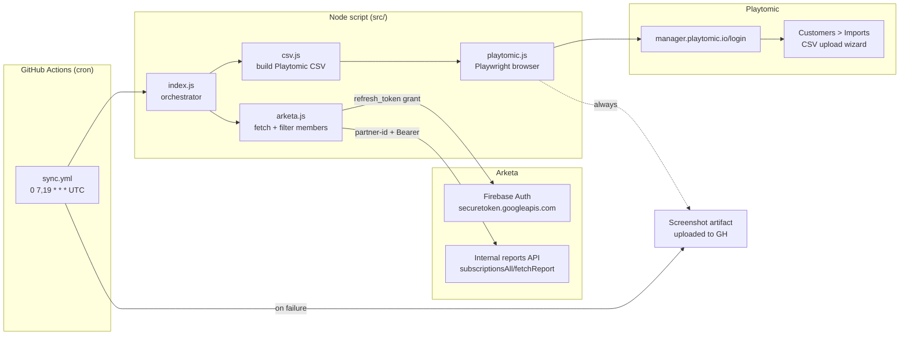

# Arketa → Playtomic Sync — Architecture

A one-way push that exports active padel members from Arketa and imports them into Playtomic twice a day, by uploading a CSV through the Playtomic manager dashboard with Playwright.

**Owner:** Antuan Libos (Icon Padel Club)
**Status:** Live

---

## 1. Why this exists

Members sign up and pay in Arketa (the club's CRM). Playtomic is where matches and bookings happen, and Playtomic's membership benefits (court discounts, etc.) only apply to customers tagged with the right `category_name` there. The Playtomic manager has no API for that import — only a CSV-upload wizard — so this sync drives the wizard with a headless browser.

Direction is one-way: **Arketa is the source of truth for membership status**, Playtomic just needs to know who's active.

The read-side counterpart is a separate repo, [`playtomic-data-sync`](https://github.com/alibos93/playtomic-data-sync), which pulls Playtomic activity into Supabase via the Third-Party API. Two repos because the auth surfaces (browser session vs. API token) and failure modes don't share much.

---

## 2. High-level architecture



One process, three stages: **fetch → transform → upload**. No database, no queue, no state. Each run is independent and idempotent on the Playtomic side (the wizard merges by email).

---

## 3. Components

### 3.1 GitHub Actions (the only runtime)

- Workflow: `.github/workflows/sync.yml`
- Schedule: `0 7,19 * * *` UTC (twice daily, 07:00 and 19:00 UTC); also `workflow_dispatch`
- Runner: `ubuntu-latest`, Node 20; installs deps + `npx playwright install chromium --with-deps`, runs `node src/index.js`
- Always uploads `/tmp/playtomic-*.png` screenshots as a `import-result` artifact (7-day retention) so a failed run can be diagnosed without re-running

### 3.2 Arketa client (`src/arketa.js`)

- Authenticates against Firebase's secure token endpoint with a long-lived refresh token, gets a fresh `id_token` per run
- Calls Arketa's internal reports endpoint `POST /reports/subscriptionsAll/fetchReport` with a `partner-id` header and a `purchase_date` window from Jan 1 of the current year through now
- Filters out canceled subscriptions and (optionally) keeps only those whose `product_name` contains one of the `MEMBERSHIP_NAMES` substrings
- Maps Arketa membership names to Playtomic benefit names by substring:

  | Arketa product contains | Playtomic `category_name` |
  |---|---|
  | `royal`  | `Royal Membership`  |
  | `iconic` | `Iconic Membership` |
  | `core`   | `Core Membership`   |
  | `rise`   | `Rise Membership`   |

  Anything else falls back to the trimmed Arketa product name. Membership expiry is hardcoded to `2027-07-01` (12 months from opening day, July 1 2026).

### 3.3 CSV builder (`src/csv.js`)

Produces a CSV matching Playtomic's customer-import format:

| Column | Source |
|---|---|
| `name` | `first_name + last_name` |
| `email` | Arketa `client_email` |
| `phone_number` | Arketa phone, normalized to `+CC XXXXXXX` (Playtomic requires a space after the country code; Arketa omits it) |
| `gender` | uppercased, may be empty |
| `birthdate` | `YYYY-MM-DD`, may be empty |
| `commercial_communications` | hardcoded `true` |
| `category_name` | mapped Playtomic benefit |
| `category_expires` | `YYYY-MM-DD` (currently `2027-07-01`) |

`category_name` is the load-bearing column — it's how Playtomic auto-assigns the right membership benefit to each imported customer.

### 3.4 Playwright uploader (`src/playtomic.js`)

A scripted walk through the Playtomic manager UI:

1. `goto /login` (with `waitUntil: 'domcontentloaded'` — Playtomic has long-polling that never reaches `networkidle`)
2. Fill email + password, submit, wait until URL leaves `/login`, dismiss any onboarding modals
3. Navigate Customers → Imports → New Import
4. **Wizard step 1:** select "Customers" object, Next
5. **Wizard step 2:** check `hasDataHandlingPermission` consent, Next
6. **Wizard step 3:** `setInputFiles` with the temp CSV, Next, dismiss the "Ok, got it" confirmation
7. Re-open the Imports list and screenshot it so the artifact shows the new row's status

Screenshots are written to `/tmp/playtomic-*.png` on success or failure.

---

## 4. Data flow per run

1. GH Actions cron fires (07:00 or 19:00 UTC); `index.js` validates env vars
2. Arketa: refresh-token grant → id_token → `subscriptionsAll/fetchReport`
3. Filter (drop `canceled`, keep matching `MEMBERSHIP_NAMES`) and map to flat member objects
4. `buildPlaytomicCSV(members)` returns a CSV string
5. `uploadCSVToPlaytomic` writes the CSV to `/tmp/playtomic-import-<ts>.csv`, launches headless chromium, walks the wizard, screenshots the result
6. Browser closes, temp CSV deleted, artifact uploaded by the post-step

---

## 5. Operations runbook

### Where to look when something breaks

| Symptom | Where |
|---|---|
| Workflow failed | GitHub → Actions tab → failed run → logs |
| Step failed silently / unexpected page | Download the `import-result` artifact and look at the screenshots |
| `Missing ARKETA_REFRESH_TOKEN…` | GH repo Settings → Secrets and variables → Actions |
| Login step times out | Playtomic credentials may have changed, or the login page markup changed |
| Wizard step click fails | Playtomic UI text changed; selectors in `src/playtomic.js` use `:has-text(...)` and need updating |
| Import succeeded but benefits not applied | Check the `category_name` mapping in `src/arketa.js` matches the actual Playtomic benefit names |

### Manual trigger

GitHub → Actions → "Daily Arketa → Playtomic Sync" → Run workflow.

### Required secrets

Configured under repo Settings → Secrets and variables → Actions:

- `ARKETA_REFRESH_TOKEN` — Firebase refresh token for the Arketa account
- `ARKETA_PARTNER_ID` — the Arketa partner (club) UUID
- `PLAYTOMIC_EMAIL`, `PLAYTOMIC_PASSWORD` — manager.playtomic.io credentials
- `MEMBERSHIP_NAMES` — comma-separated substrings to filter Arketa products by (optional; empty = sync all non-canceled)

### Local run

```
npm install
npx playwright install chromium
cp .env.example .env  # then fill in the same vars
node src/index.js
```

---

## 6. Costs

| Item | Cost |
|---|---|
| GitHub Actions | ~5 min/run × 2/day ≈ 300 min/month, free tier is 2000 |
| Everything else | $0 |
| **Total** | **$0/month** |

---

## 7. Repo layout

```
arketa-playtomic-sync/
├── src/
│   ├── index.js          # entry point + env validation + orchestration
│   ├── arketa.js         # Firebase auth + subscriptions fetch + member mapping
│   ├── csv.js            # CSV builder + phone formatter
│   └── playtomic.js      # Playwright wizard walker
├── .github/workflows/
│   └── sync.yml          # cron + workflow_dispatch
├── package.json          # deps: axios, csv-stringify, dotenv, playwright
├── README.md
└── ARCHITECTURE.md       # this file
```

---

## 8. Extension points

- **Rolling member window.** Arketa fetch uses Jan 1 → today as the `purchase_date` filter. A rolling 13-month window would catch older active subs.
- **Real expiry per member.** `membership_expires` is hardcoded to `2027-07-01`; could be derived from the Arketa subscription's actual end date.
- **Diff-based uploads.** Every run uploads every active member. Playtomic dedupes by email so it's safe, but a snapshot would let us upload only the delta.
- **Failure notifications.** Failure currently surfaces only in the Actions tab — a Slack/email notify step would close the loop.
- **Selector resilience.** Playwright selectors are text-based (`:has-text("Next")`); a `selectors.js` extraction would localize the blast radius if Playtomic's UI changes.
